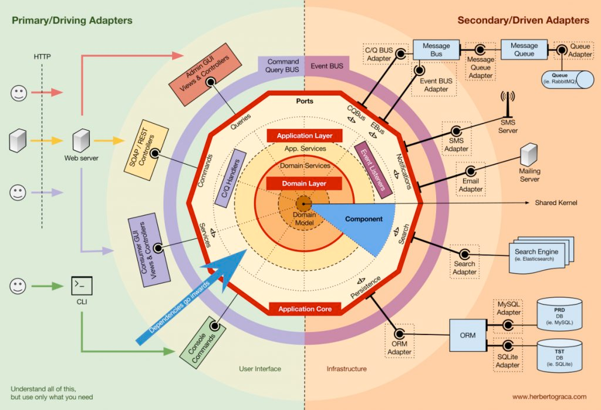
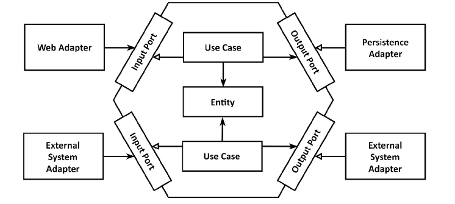

# 클린 아키텍처 찍먹하기

전통적인 계층형 모델에서 보완을 위해 고완된 아키텍처 방법  
꼭 이 방법이 아니더라도 좋은 방법이 있는지 생각해보기!!   



서비스가 커지면서 요구사항이 늘어나, 추가적으로 API를 만들게 되면 의존이 너무 많이 되어, 나중에 요구조건을 바꾸기 힘듬 ㅠㅠ  

- 외부 요소에 의존하지 않고 비지니스로직에 집중할 수 있도록 만듬




- 헥사고날 아키텍처는 포트와 어댑터 아키텍처로 부르기도 한다고 했다.  
- 육각형 바깥에는 애플리케이션과 상호작용하는 어댑터가 있다. 
- 일부 어댑터는 외부 시스템과 상호작용하며, 데이터베이스와 상호 작용하는 어댑터도 있다.   

```
클린 아키텍처와 헥사고날 아키텍처 모두 의존성을 역전시켜 도메인 코드가 바깥쪽 코드에 의존하지 않게 함으로써 외부로 부터의 도메인 로직의 결합을 제거한다. 변경할 이유가 적을수록 유지보수성이 높은 코드가 된다.
```

```
user-api : application을 호출하는 in, out 제공
user-application: 도메인 모델을 둘러싼 서비스
user-domain : entity, vo 등 로직에 대한 기술에 독립적인 POJO로 개발사용
```

## 라이브러리 써보기

- java ORM 은 JPA kotlin은??
- 젯브레인에서 만든 exposed가 유명 but... jpa도 Querydsl를 많이쓰는것 처럼 exposed는 없을까?

jdsl...

```
@Configuration
class JdslConfiguration(
    private val entityManager: EntityManager
) {

    @Bean
    fun queryFactory(): SpringDataQueryFactory {
        return SpringDataQueryFactoryImpl(
            criteriaQueryCreator = CriteriaQueryCreatorImpl(entityManager),
            subqueryCreator = SubqueryCreatorImpl()
        )
    }
}
```

설정으로 사용할 수 있음.  
리액티브로 지원하고 있는 라인에서 만든 라이브러리  


```
fun findByName(name: String): UserEntity? {
    return queryFactory.singleOrNullQuery<UserEntity> {
        select(entity(UserEntity::class))
        from(entity(UserEntity::class))
        where(column(UserEntity::name).equal(name))
    }
}
```

